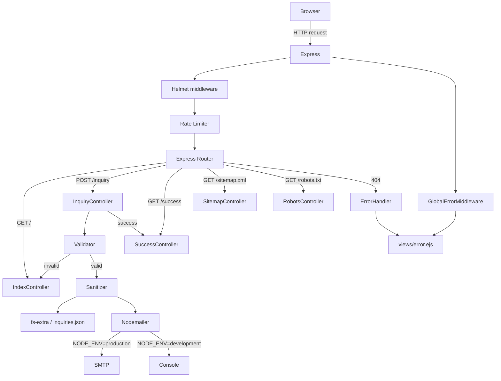

# Design Document: Pragya Path Improvements

## Overview

Pragya Path is a Hatha Yoga & Sound Healing studio website based in Bhaktapur, Nepal. The current implementation is a minimal Express.js/EJS single-page application with a bare-bones inquiry form and no production-readiness features. This design covers the full set of improvements needed to make the site production-ready:

- **Environment configuration** via `dotenv`
- **Server-side validation and sanitization** of the inquiry form
- **Email notifications** via Nodemailer
- **Security hardening** with Helmet and rate limiting
- **Proper error handling** with branded error/success pages
- **Mobile navigation** with a vanilla JS hamburger menu
- **SEO basics** (meta tags, Open Graph, sitemap, robots.txt)
- **Tailwind CSS build step** replacing the CDN runtime

The application remains a single-page Express.js/EJS app. No admin panel, booking system, or database is introduced.

---

## Architecture

The application follows a simple MVC-adjacent pattern with Express.js as the HTTP layer, EJS as the view layer, and JSON files as the persistence layer.



### Key Architectural Decisions

1. **Single `server.js` with inline route handlers** — the codebase is small enough that extracting controllers to separate files would add indirection without benefit. Validation and mailer logic are extracted to dedicated modules (`lib/validator.js`, `lib/mailer.js`) to keep `server.js` readable.
2. **JSON file storage is retained** — `inquiries.json` continues to be the persistence layer. No database is introduced.
3. **EJS partial for shared head/nav** — the brand head (fonts, CSS link, meta tags) and navbar are extracted into EJS partials (`views/partials/head.ejs`, `views/partials/nav.ejs`) so that `success.ejs` and `error.ejs` can reuse them without duplication.
4. **Tailwind CLI replaces CDN** — a `public/css/input.css` source file and a compiled `public/css/output.css` artefact replace the CDN `<script>` tag. The config is extracted to `tailwind.config.js`.

---

## Components and Interfaces

### 1. Environment Configuration (`lib/config.js`)

Loads and validates environment variables. Called once at startup before any other module.

```js
// lib/config.js
require('dotenv').config();

const REQUIRED = ['EMAIL_HOST', 'EMAIL_PORT', 'EMAIL_USER', 'EMAIL_PASS', 'EMAIL_TO'];

module.exports = {
  PORT: process.env.PORT || 3001,
  NODE_ENV: process.env.NODE_ENV || 'development',
  EMAIL_HOST: process.env.EMAIL_HOST,
  EMAIL_PORT: process.env.EMAIL_PORT,
  EMAIL_USER: process.env.EMAIL_USER,
  EMAIL_PASS: process.env.EMAIL_PASS,
  EMAIL_TO: process.env.EMAIL_TO,
};

// Startup validation — called from server.js before app.listen()
function validateEnv() {
  const missing = REQUIRED.filter(k => !process.env[k]);
  if (missing.length) {
    console.error(`[config] Missing required environment variables: ${missing.join(', ')}`);
    process.exit(1);
  }
}

module.exports.validateEnv = validateEnv;
```

**Interface**: `config.PORT`, `config.NODE_ENV`, `config.EMAIL_*`, `config.validateEnv()`

---

### 2. Validator (`lib/validator.js`)

Pure functions that validate and sanitize inquiry form fields. Returns a structured result object so the route handler can decide what to do.

```js
// lib/validator.js

/**
 * @typedef {Object} ValidationResult
 * @property {boolean} valid
 * @property {Object} errors  — field name → error message string
 * @property {Object} values  — sanitized field values (only populated when valid)
 */

/**
 * Validates and sanitizes inquiry form input.
 * @param {{ name, email, phone, message }} body
 * @returns {ValidationResult}
 */
function validateInquiry(body) { ... }

/**
 * Strips all HTML tags from a string.
 * @param {string} str
 * @returns {string}
 */
function stripHtml(str) { ... }

module.exports = { validateInquiry, stripHtml };
```

**Validation rules** (mirrors requirements):

| Field     | Rule |
|-----------|------|
| `name`    | Required, 2–100 chars |
| `email`   | Required, valid RFC 5321 format |
| `message` | Required, 10–2000 chars |
| `phone`   | Optional; if present: digits/spaces/`+`/`-`/`()`/7–20 chars |

**Sanitization**: `stripHtml` is applied to all four fields after validation passes.

---

### 3. Mailer (`lib/mailer.js`)

Wraps Nodemailer. In `development` mode, logs the email to the console instead of sending it.

```js
// lib/mailer.js
const nodemailer = require('nodemailer');
const config = require('./config');

/**
 * Sends (or logs) an inquiry notification email.
 * @param {{ name, email, phone, message, date }} inquiry
 * @returns {Promise<void>}  — resolves even if send fails (error is logged)
 */
async function sendInquiryNotification(inquiry) { ... }

module.exports = { sendInquiryNotification };
```

Email format:
- **Subject**: `New Inquiry from <name> – Pragya Path`
- **Body** (plain text): name, email, phone (if present), message, timestamp

---

### 4. Express Application (`server.js`)

Responsibilities after refactor:

- Load `lib/config.js` and call `validateEnv()` before anything else
- Apply middleware: `helmet`, `express-rate-limit`, `express.urlencoded({ extended: false, limit: '10kb' })`, `express.static`
- Define routes: `GET /`, `POST /inquiry`, `GET /success`, `GET /sitemap.xml`, `GET /robots.txt`
- Register 404 and global error-handling middleware
- Call `app.listen()`

---

### 5. Views

| File | Purpose |
|------|---------|
| `views/partials/head.ejs` | `<head>` with SEO meta, OG tags, CSS link, fonts |
| `views/partials/nav.ejs` | Navbar with desktop links + mobile hamburger |
| `views/index.ejs` | Main single-page content; includes partials; inquiry form with phone field and validation errors |
| `views/success.ejs` | Branded success confirmation page |
| `views/error.ejs` | Branded 404/500 error page |

---

### 6. Static Assets

| Path | Purpose |
|------|---------|
| `public/css/input.css` | Tailwind source (`@tailwind base/components/utilities`) |
| `public/css/output.css` | Compiled Tailwind output (gitignored) |
| `tailwind.config.js` | Content paths + custom theme (brand colours, fonts) |
| `public/sitemap.xml` | Static sitemap served at `/sitemap.xml` |
| `public/robots.txt` | Static robots file served at `/robots.txt` |

---

## Data Models

### Inquiry Object (stored in `inquiries.json`)

```json
{
  "inquiries": [
    {
      "name": "Sita Sharma",
      "email": "sita@example.com",
      "phone": "+977 9800000000",
      "message": "I would like to join the 200-hour RYT program.",
      "date": "2024-07-15T08:30:00.000Z"
    }
  ]
}
```

Fields:
- `name` — string, 2–100 chars, HTML-stripped
- `email` — string, valid email, HTML-stripped
- `phone` — string or `null`, optional, HTML-stripped
- `message` — string, 10–2000 chars, HTML-stripped
- `date` — ISO 8601 timestamp set at submission time

### Environment Variables (`.env.example`)

```
PORT=3001
NODE_ENV=development

EMAIL_HOST=smtp.example.com
EMAIL_PORT=587
EMAIL_USER=your@email.com
EMAIL_PASS=yourpassword
EMAIL_TO=studio@pragyapath.com
```

### Rate Limit Configuration

```js
{
  windowMs: 15 * 60 * 1000,  // 15 minutes
  max: 10,                    // requests per window per IP
  standardHeaders: true,
  legacyHeaders: false,
}
```

Applied only to `POST /inquiry`.

---

## Correctness Properties

*A property is a characteristic or behavior that should hold true across all valid executions of a system — essentially, a formal statement about what the system should do. Properties serve as the bridge between human-readable specifications and machine-verifiable correctness guarantees.*

### Property 1: Validator correctly classifies all inquiry inputs

*For any* inquiry submission, the validator SHALL return `valid: true` when all fields satisfy their rules (name 2–100 chars, email valid RFC 5321 format, message 10–2000 chars, phone — if present — only digits/spaces/`+`/`-`/`()` and 7–20 chars), and SHALL return `valid: false` with a non-empty field-level error message for every failing field when any rule is violated.

**Validates: Requirements 2.1, 2.2, 2.3, 2.4, 2.5**

---

### Property 2: HTML stripping is idempotent

*For any* string, applying `stripHtml` twice SHALL produce the same result as applying it once — i.e., `stripHtml(stripHtml(s)) === stripHtml(s)`.

**Validates: Requirements 2.6**

---

### Property 3: Sanitized values contain no HTML tags

*For any* string input (including strings with nested, malformed, or encoded HTML tags), the output of `stripHtml` SHALL contain no substring matching the pattern `/<[^>]+>/`.

**Validates: Requirements 2.6**

---

### Property 4: Email notification contains all required content

*For any* valid inquiry object, the email notification generated by the Mailer SHALL have a subject containing the submitter's `name` field, and a plain-text body containing the submitter's name, email address, message, and submission timestamp. When `phone` is present in the inquiry, it SHALL also appear in the body.

**Validates: Requirements 3.3**

---

## Error Handling

### Validation Errors (400-equivalent)

When `validateInquiry` returns `valid: false`, the route handler re-renders `index.ejs` with:
- `errors` — object mapping field names to error strings
- `values` — the original submitted values (so the user does not lose their input)

The HTTP status code is left as 200 (standard form re-render pattern) since the page is re-rendered, not redirected.

### Rate Limit Exceeded (429)

`express-rate-limit` is configured with a custom `handler` that renders `error.ejs` with a "Too many requests — please try again in 15 minutes" message and HTTP 429.

### 404 Not Found

A catch-all route after all defined routes renders `error.ejs` with a "Page Not Found" message and HTTP 404.

### 500 Internal Server Error

All async route handlers are wrapped in `try/catch` and forward errors to the Express error-handling middleware (`app.use((err, req, res, next) => {...})`). The error middleware renders `error.ejs` with:
- HTTP 500
- "Something went wrong" message
- Stack trace only when `NODE_ENV !== 'production'`

### Email Send Failure

If `sendInquiryNotification` throws, the error is caught and logged. The inquiry has already been persisted to `inquiries.json` at that point, so the visitor is still redirected to `/success`. This ensures email failures are non-fatal.

### Missing Environment Variables

`validateEnv()` is called synchronously before `app.listen()`. If required variables are absent, the process logs a descriptive message and exits with code 1, preventing the server from starting in a misconfigured state.

---

## Testing Strategy

### Unit Tests

Use **Jest** (or the project's preferred test runner — Jest is the standard Node.js choice and has no additional runtime dependencies beyond `devDependencies`).

Focus areas for unit tests:
- `lib/validator.js` — specific examples: empty name, name at boundary lengths (1 char, 2 chars, 100 chars, 101 chars), invalid email formats, message at boundaries, phone with illegal characters
- `lib/mailer.js` — mock `nodemailer.createTransport` and verify the correct subject/body is constructed; verify console-log path in development mode
- `lib/config.js` — verify `validateEnv` exits with code 1 when a required variable is missing

### Property-Based Tests

Use **[fast-check](https://github.com/dubzzz/fast-check)** for property-based testing. Each property test runs a minimum of **100 iterations**.

Tag format for each test: `// Feature: pragya-path-improvements, Property <N>: <property_text>`

**Property 1 — Validator correctly classifies all inquiry inputs**
Generate two sets of inputs: (a) fully valid inputs (name 2–100 printable chars, valid email, message 10–2000 chars, optional valid phone) and assert `validateInquiry` returns `{ valid: true }`; (b) inputs with at least one deliberately invalid field and assert `validateInquiry` returns `{ valid: false }` with a non-empty error for each failing field.

**Property 2 — HTML stripping is idempotent**
Generate arbitrary strings (including strings with `<`, `>`, and HTML-like content) and assert `stripHtml(stripHtml(s)) === stripHtml(s)`.

**Property 3 — Sanitized values contain no HTML tags**
Generate arbitrary strings and assert the output of `stripHtml` contains no substring matching `/<[^>]+>/`.

**Property 4 — Email notification contains all required content**
Generate arbitrary valid inquiry objects (with and without `phone`) and assert the subject contains the `name` field, and the body contains `name`, `email`, `message`, and `date`. When `phone` is present, assert it also appears in the body.

### Integration / Smoke Tests

- **Smoke**: Start the server with a valid `.env` and verify it responds to `GET /` with HTTP 200.
- **Integration**: Submit a valid inquiry via `POST /inquiry` and verify the entry appears in `inquiries.json` and the response redirects to `/success`.
- **Integration**: Submit an invalid inquiry and verify the response re-renders the form with error messages.
- **Integration**: Verify `GET /sitemap.xml` and `GET /robots.txt` return HTTP 200 with correct content types.
- **Integration**: Verify `GET /nonexistent` returns HTTP 404 and renders the error page.

### Manual / Visual Tests

- Mobile navigation: verify hamburger appears below `lg` breakpoint, dropdown opens/closes correctly, links scroll to sections.
- Tailwind build: run `npm run build:css` and verify `public/css/output.css` is generated and the site renders correctly without the CDN script.
- SEO: verify meta tags and OG tags are present in the rendered HTML using browser DevTools or a meta-tag checker.
